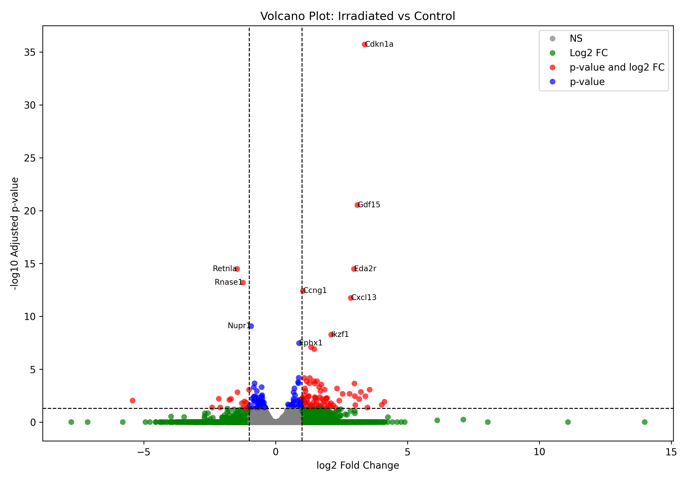
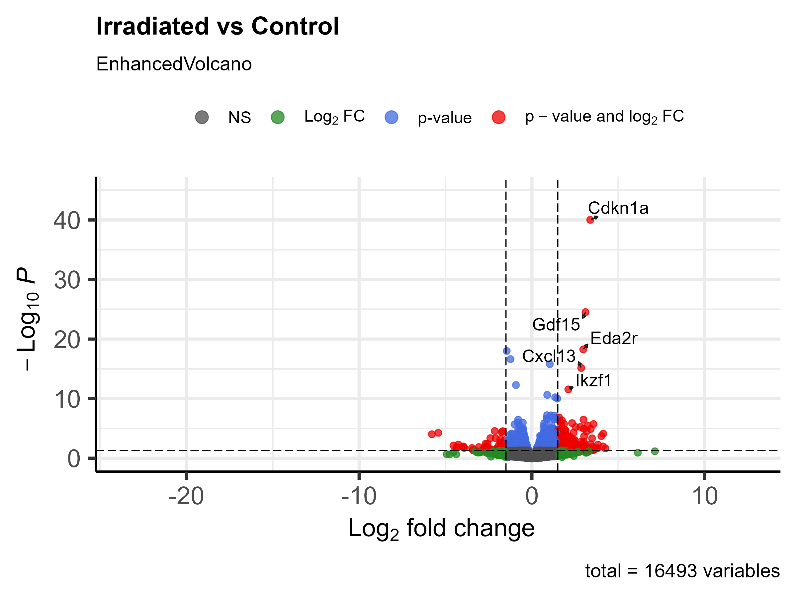

# RNA-Seq & Pathway Enrichment Analysis of Irradiated Mouse Salivary Tissue

This project analyzes transcriptomic changes in irradiated mouse salivary gland tissue using RNA sequencing (RNA-seq). We perform differential gene expression analysis and KEGG pathway enrichment in both R and Python environments. The project culminates in a formal white paper comparing methodological pipelines across programming languages.

---

## 🎯 Project Objectives

- ✅ **Identify differentially expressed genes (DEGs)** from RNA-seq data using DESeq2 (R) and pyDESeq2 (Python)
- ✅ **Perform KEGG pathway enrichment** using clusterProfiler (R) and gprofiler-official (Python)
- ✅ **Compare R and Python pipelines** for RNA-seq analysis and visualization
- ✅ **Produce a professional white paper** documenting the full methodology, code, figures, and findings

---

## 🧬 Data Source

- **RNA-Seq**: [NCBI GEO - GSE155902](https://www.ncbi.nlm.nih.gov/geo/query/acc.cgi?acc=GSE155902)

---

## 📦 Tools & Packages Used

### R
- `DESeq2`
- `clusterProfiler`
- `org.Mm.eg.db`
- `AnnotationDbi`
- `EnhancedVolcano`
- `pheatmap`
- `readr`, `dplyr`, `ggplot2`, `tidyverse`, `purr`

### Python
- `pyDESeq2`
- `gprofiler-official`
- `gseapy`
- `mygene`
- `pandas`, `seaborn`, `matplotlib`, `scikit-learn`, `numpy`
- `os`, `glob`
---

## 📊 Example Outputs

### Volcano Plot  
#### Python Implimentation 

#### R Implimentation 

---

## 📄 White Paper

The formal technical white paper is located in the `whitepaper/` folder.

**Format**: `.docx`  
**Title**: *Comparative Transcriptomic Analysis of Irradiated Mouse Salivary Glands Using R and Python Pipelines*  

Contents include:  
- Research background and biological motivation  
- RNA-seq processing steps and DEG filtering  
- KEGG enrichment workflow and results  
- Visualizations (PCA, heatmaps, volcano plots, barplots)  
- Reflections on tool performance and reproducibility

🔗 [View whitepaper](https://github.com/nbishtawi/rna-seq-pathway-analysis/blob/main/whitepaper/Comparative%20Transcriptomic%20Analysis%20of%20Irradiated%20Mouse%20Salivary%20Glands%20Using%20R%20and%20Python%20Pipelines.docx)
