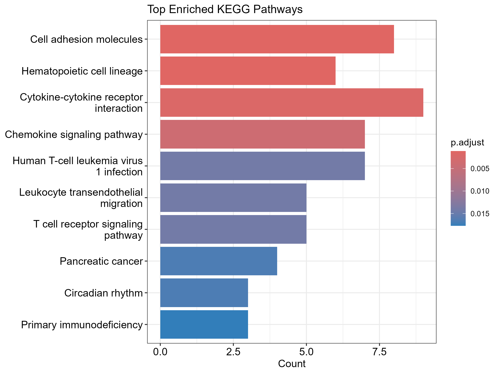
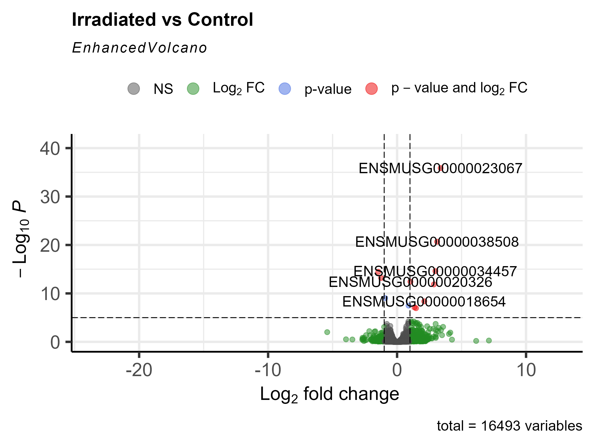

# RNA-Seq & Pathway Enrichment Analysis of Irradiated Mouse Salivary Tissue

This project explores transcriptomic changes in irradiated mouse salivary gland tissue using publicly available RNA-seq data. We identify differentially expressed genes (DEGs) and investigate enriched biological pathways using KEGG pathway analysis.

The analysis is performed using R and Bioconductor packages, including **DESeq2** for differential expression and **clusterProfiler** for pathway enrichment.

---

## 🎯 Objectives

- Load and merge raw gene count data
- Perform differential expression analysis (irradiated vs untreated) with DESeq2
- Visualize results using volcano plot and heatmap
- Perform KEGG pathway enrichment with clusterProfiler
- Save all outputs in structured folders (`results/`, `figures/`)

---

## 📦 Tools and Packages

- [`DESeq2`](https://bioconductor.org/packages/release/bioc/html/DESeq2.html)
- [`clusterProfiler`](https://bioconductor.org/packages/release/bioc/html/clusterProfiler.html)
- `org.Mm.eg.db` (mouse gene annotation)
- `EnhancedVolcano`, `pheatmap`, `readr`, `dplyr`, `tibble`, `purrr`

---

## 📊 Sample Outputs

### Top Enriched KEGG Pathways  

### Volcano Plot of DEGs  

📚 Data Sources
RNA-Seq: NCBI GEO - GSE155902

Metabolomics: Zenodo - DOI: 10.5281/zenodo.4391402
